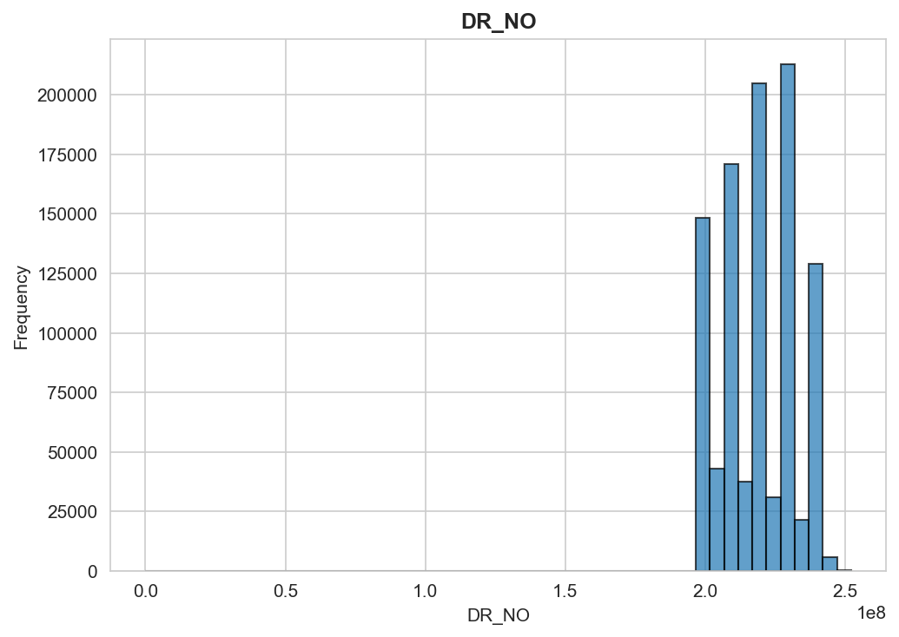
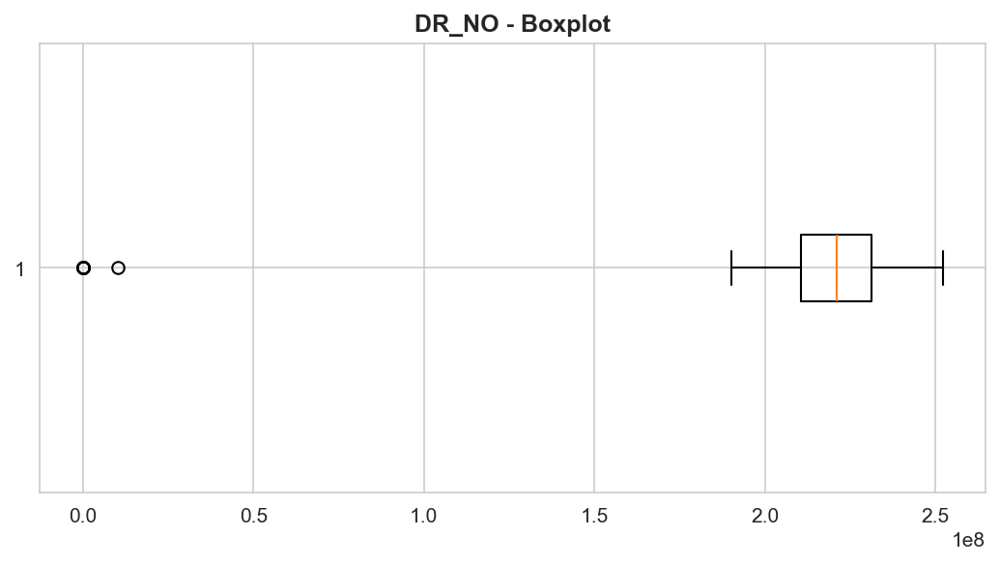
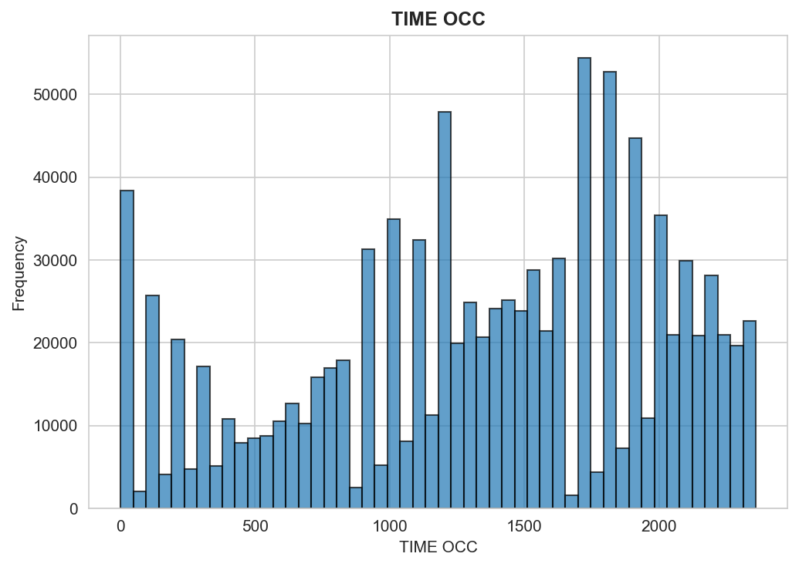
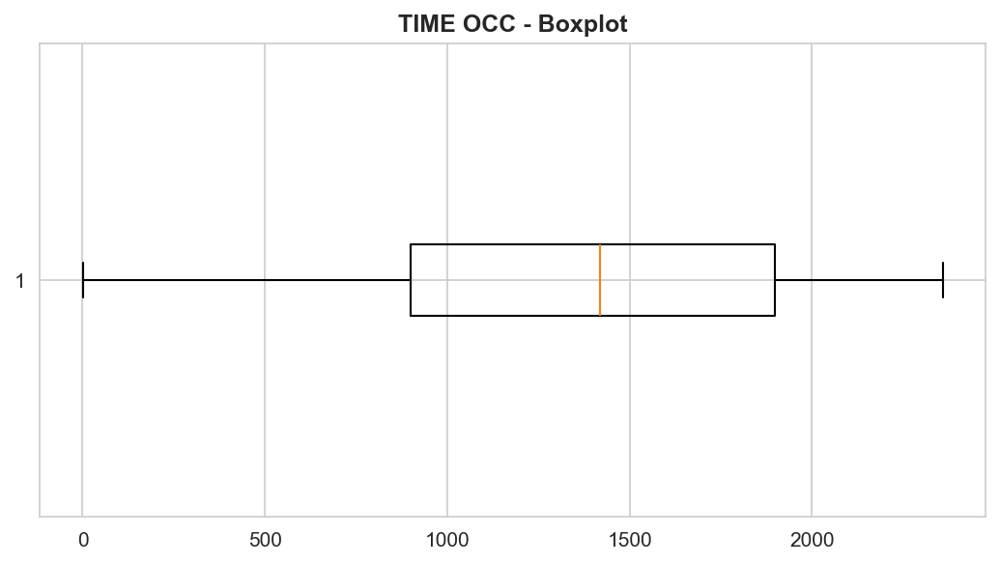
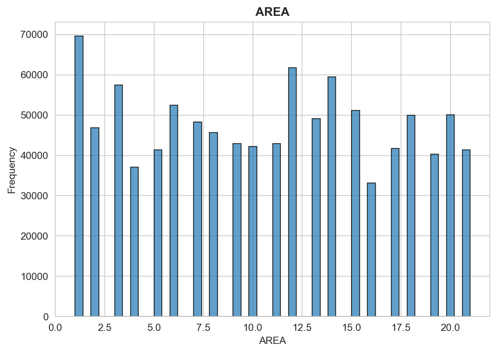
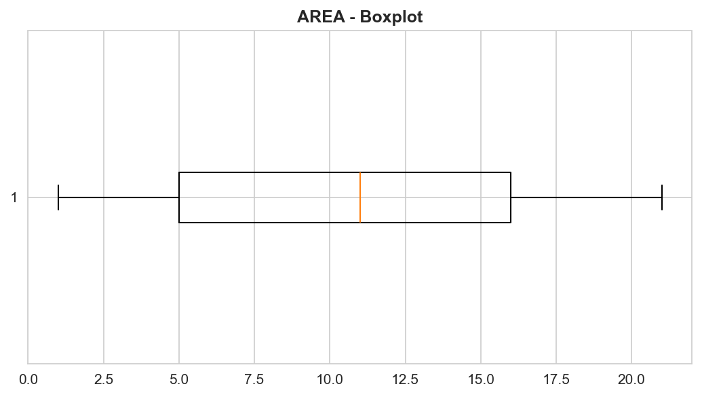
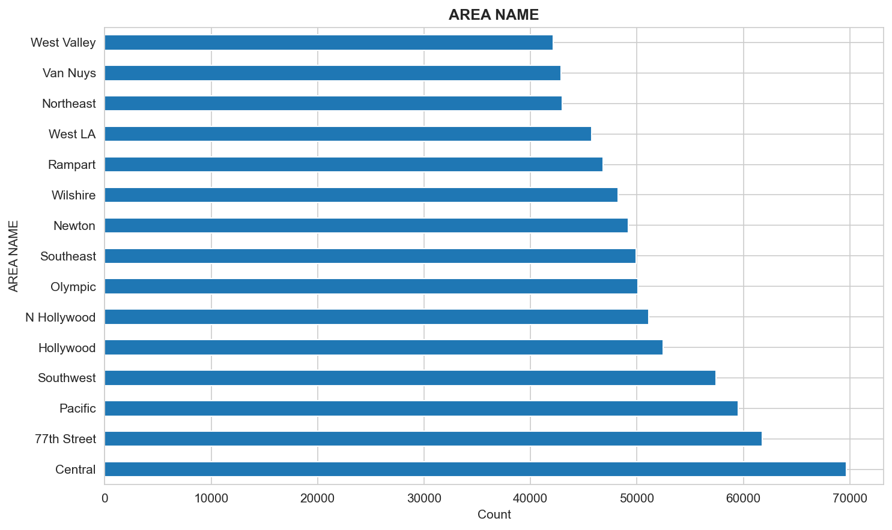
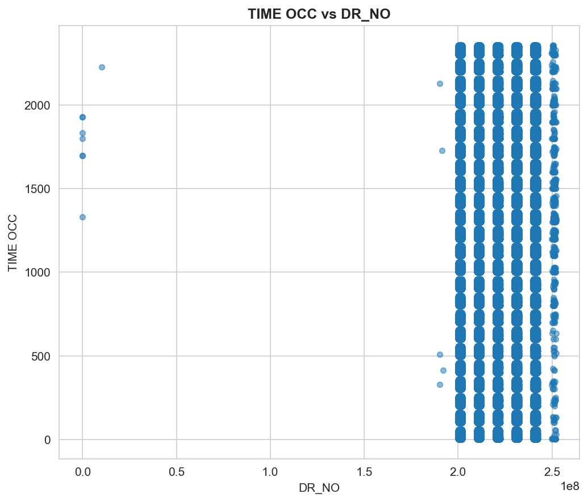
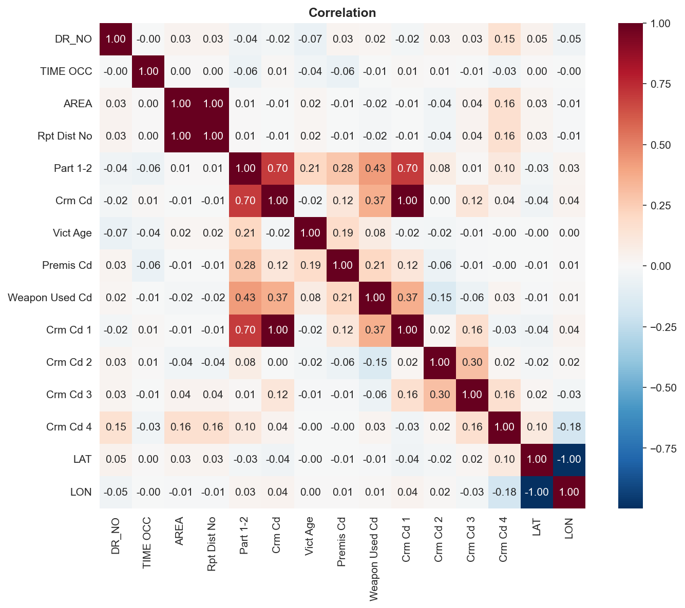

**PRIVACY WARNING**: Sensitive columns detected

# Overview

- Rows: 1,004,991
- Columns: 28
- Duplicates: 0
- High Missing: Weapon Used Cd, Weapon Desc, Crm Cd 2, Crm Cd 3, Crm Cd 4
- Dates: Date Rptd, DATE OCC

\newpage

# Numeric Analysis

## DR_NO

Min: 817.00 | Max: 252104146.00 | Mean: 220221530.16 | Median: 220915885.00 | Std: 13197182.56

Outliers: 8 (0.0%)

{ width=48% } { width=48% }

## TIME OCC

Min: 1.00 | Max: 2359.00 | Mean: 1339.90 | Median: 1420.00 | Std: 651.06

Outliers: 0 (0.0%)

{ width=48% } { width=48% }

## AREA

Min: 1.00 | Max: 21.00 | Mean: 10.69 | Median: 11.00 | Std: 6.11

Outliers: 0 (0.0%)

{ width=48% } { width=48% }

\newpage

# Categorical: AREA NAME

| Value | Count | % |
|-------|-------|---|
| Central | 69,670 | 6.9 |
| 77th Street | 61,758 | 6.1 |
| Pacific | 59,514 | 5.9 |
| Southwest | 57,441 | 5.7 |
| Hollywood | 52,429 | 5.2 |
| N Hollywood | 51,107 | 5.1 |
| Olympic | 50,071 | 5.0 |
| Southeast | 49,936 | 5.0 |
| Newton | 49,177 | 4.9 |
| Wilshire | 48,239 | 4.8 |

{ width=70% }

\newpage

# Correlation

{ width=48% } { width=48% }

\newpage

# Key Insights

1. 1,004,991 rows x 28 cols, 80.1% complete

2. No duplicates - good quality

3. 6 columns >50% missing: Weapon Used Cd, Weapon Desc, Crm Cd 2

4. Vict Age: highest variability (range: -4.0 to 120.0)

5. Crm Cd 2: 20.0% outliers

6. AREA NAME: 'Central' dominates (6.9%)

7. Strong correlation (1.00): Crm Cd <-> Crm Cd 1

8. Date Rptd: 1981 day span

9. WARNING: 1 sensitive columns detected

# Limitations

- Missing data in 6 columns may bias results
- Dataset represents specific time/location scope
- 1 columns may contain sensitive information

*Auto-generated. All statistics verified.*
