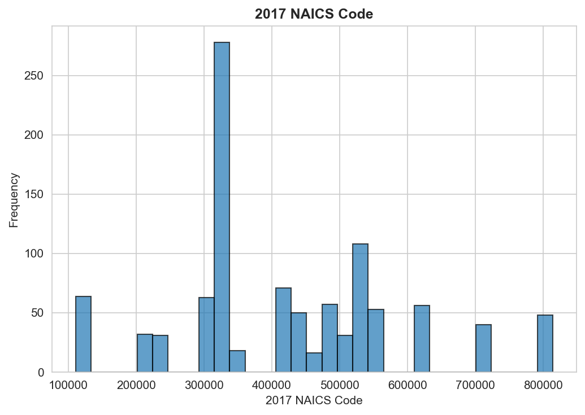
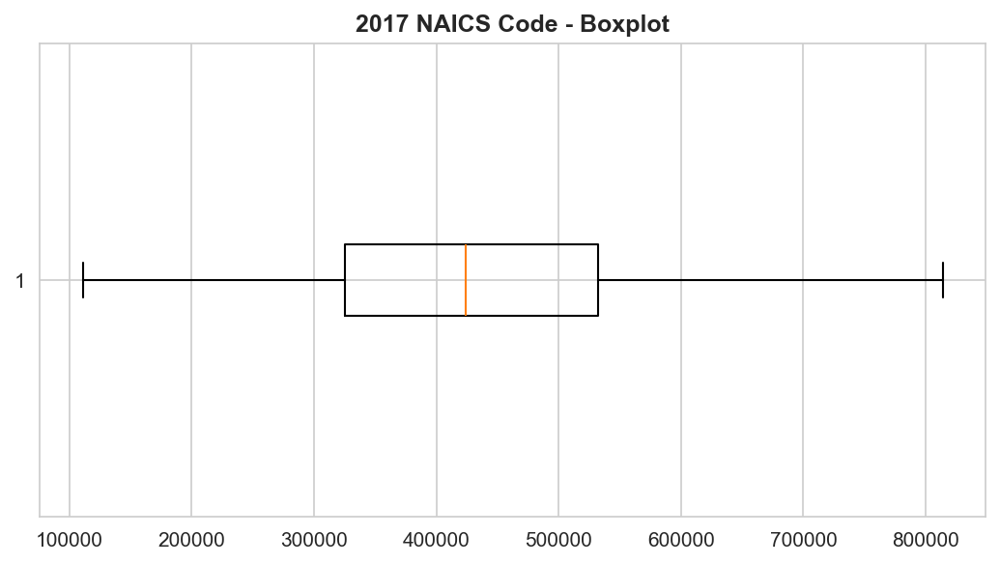

**PRIVACY WARNING**: Sensitive columns detected

# Overview

- Rows: 1,016
- Columns: 8
- Duplicates: 0

\newpage

# Numeric Analysis

## 2017 NAICS Code

Min: 111110.00 | Max: 813990.00 | Mean: 424917.38 | Median: 423700.00 | Std: 164942.11

Outliers: 0 (0.0%)

{ width=48% } { width=48% }

## Supply Chain Emission Factors without Margins

Min: 0.03 | Max: 3.85 | Mean: 0.26 | Median: 0.16 | Std: 0.31

Outliers: 93 (9.2%)

{ width=48% } { width=48% }

## Margins of Supply Chain Emission Factors

Min: 0.00 | Max: 0.12 | Mean: 0.02 | Median: 0.00 | Std: 0.02

Outliers: 17 (1.7%)

{ width=48% } { width=48% }

\newpage

# Categorical: 2017 NAICS Title

| Value | Count | % |
|-------|-------|---|
| Soybean Farming | 1 | 0.1 |
| Book Publishers | 1 | 0.1 |
| Other Support Activities for Road Transportation | 1 | 0.1 |
| Freight Transportation Arrangement | 1 | 0.1 |
| Packing and Crating | 1 | 0.1 |
| All Other Support Activities for Transportation | 1 | 0.1 |
| Postal Service | 1 | 0.1 |
| Couriers and Express Delivery Services | 1 | 0.1 |
| Local Messengers and Local Delivery | 1 | 0.1 |
| General Warehousing and Storage | 1 | 0.1 |

{ width=70% }

\newpage

# Correlation

{ width=48% } { width=48% }

\newpage

# Key Insights

1. 1,016 rows x 8 cols, 100.0% complete

2. No duplicates - good quality

3. Margins of Supply Chain Emission Factors: highest variability (range: 0.0 to 0.1)

4. Supply Chain Emission Factors without Margins: 9.2% outliers

5. 2017 NAICS Title: 'Soybean Farming' dominates (0.1%)

6. Strong correlation (1.00): Supply Chain Emission Factors without Margins <-> Supply Chain Emission Factors with Margins

7. WARNING: 2 sensitive columns detected

# Limitations

- Dataset represents specific time/location scope
- 2 columns may contain sensitive information

*Auto-generated. All statistics verified.*
